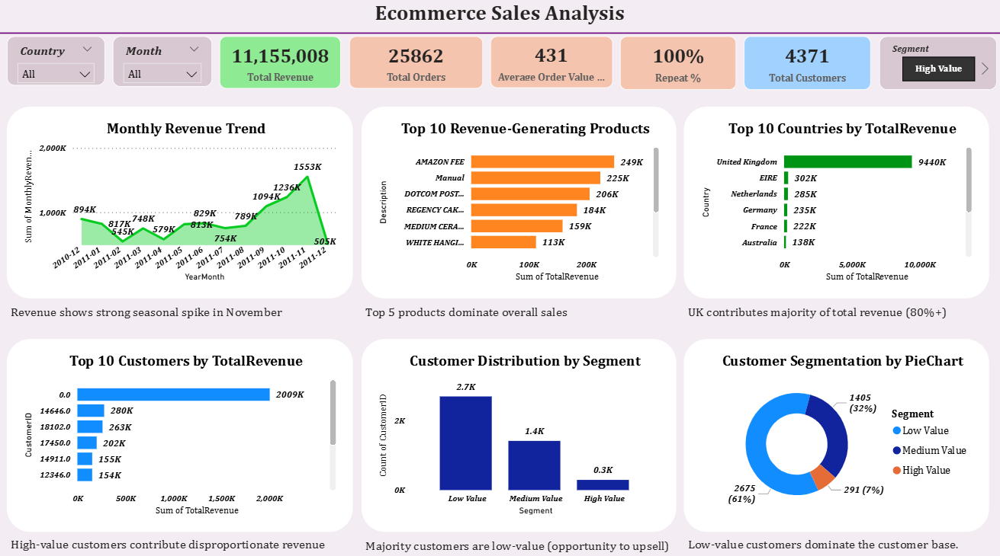

# 📊 E-commerce Sales Data Analysis & Dashboard (SQL + Power BI)

## 📌 Project Overview
I worked on an end-to-end E-commerce Sales Data Analysis project to derive meaningful business insights from raw transactional data.

The project involved data cleaning, transformation, analysis, and visualization to understand sales performance, customer behavior, and product trends.

---

## 🛠️ Tools Used
- SQL
- Python (Pandas)
- Power BI
- Excel

---

## 📊 Dashboard Preview

---

## 📊 Key Work Done
- Cleaned and transformed raw data to ensure accuracy and consistency  
- Performed SQL analysis to identify revenue trends and customer segments  
- Built an interactive Power BI dashboard to track KPIs and business performance  
- Created visualizations to present insights in a clear and actionable format  

---

## 📈 Key Insights
- Identified top-performing products contributing to majority of revenue  
- Analyzed repeat customer behavior and purchasing patterns  
- Observed monthly sales trends and seasonal spikes  

---

## 📁 Files in Repository
- `analysis.sql` → SQL queries used for analysis  
- `online_retail.zip` → Dataset  
- `dashboard.png` → Power BI dashboard screenshot  

---

## 🎯 Outcome
This project demonstrates my ability to work with raw data, perform analysis, and present insights using dashboards to support data-driven decision making.
